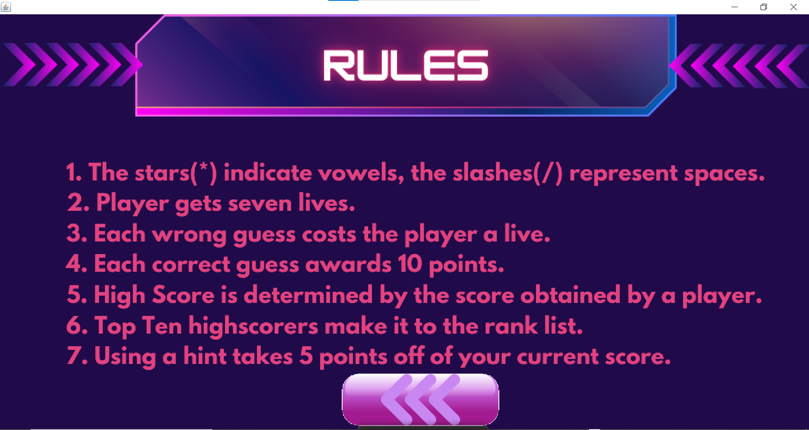
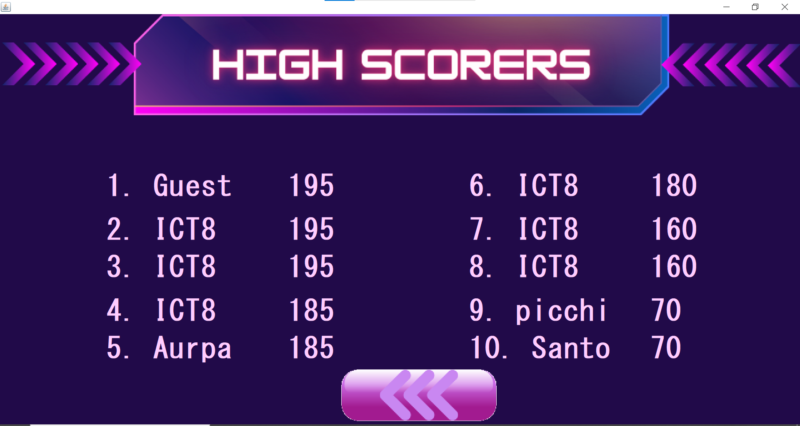
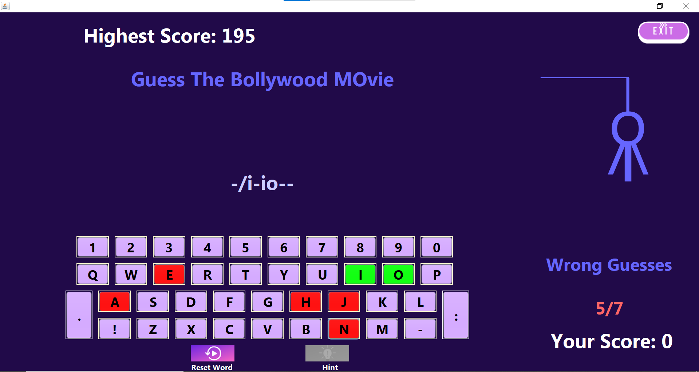
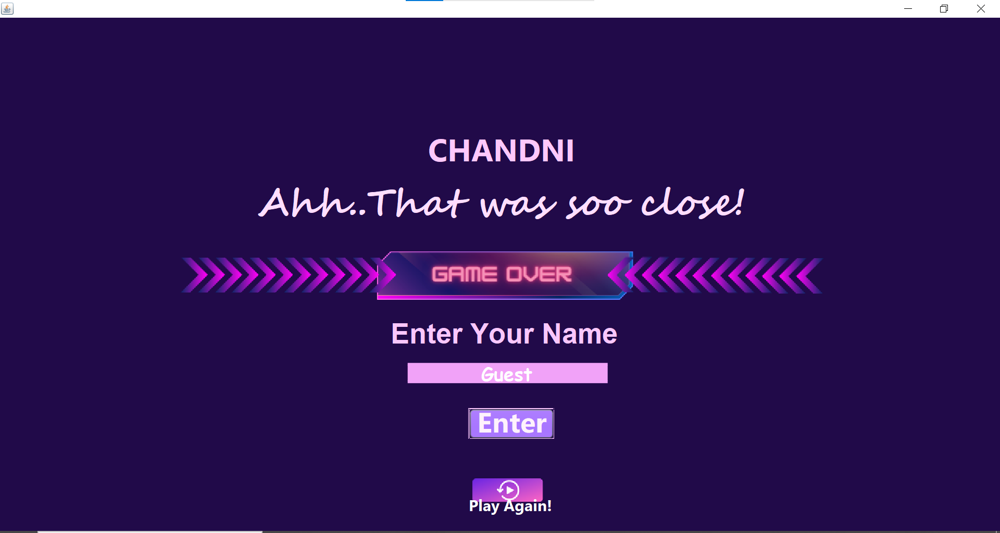
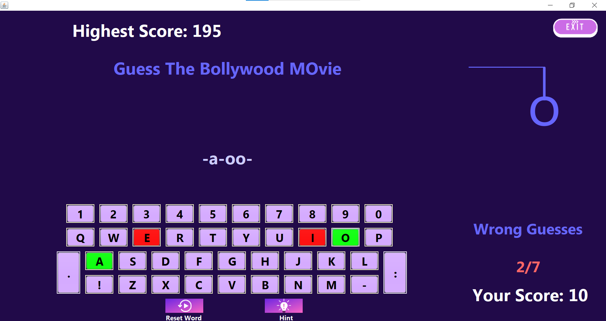
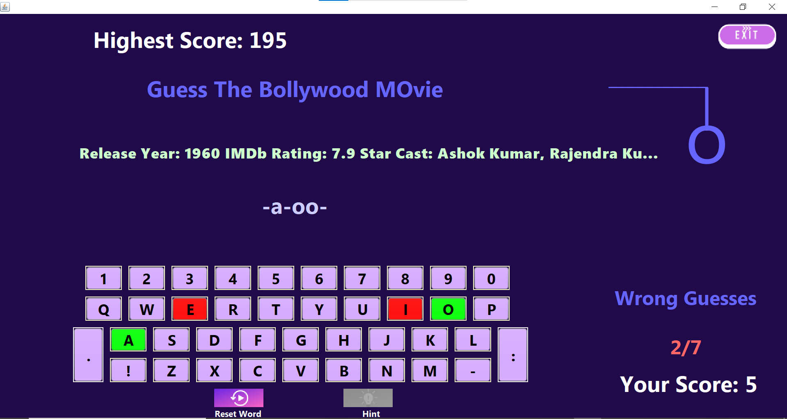
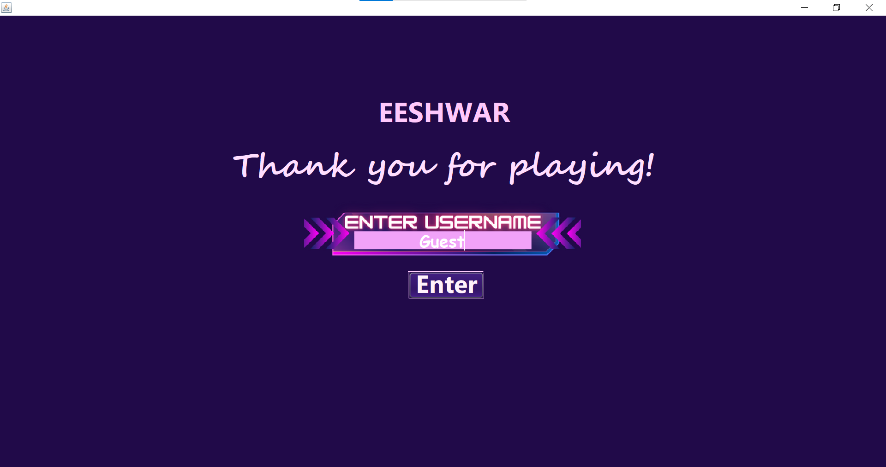

# Hangman-Game-Java-
The classic hangman game implemented using Java  (Javax, Swing, etc). 
# Overview
### Home

### Rules

### Score

### Option

### Game

### Congratulations

### Game Over

### Hint
Every hint costs 5 score points

### Exit

# Note
If trying to implement this project on your device, please change the filepaths accordingly.
